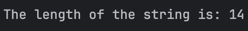
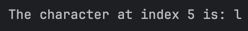
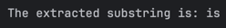
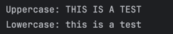
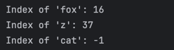
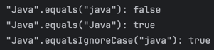
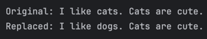
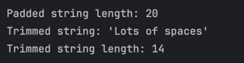

# Hands-on Lab: Exploring Java String Methods
## Author: Luis Maverick Gabriel

### Exercise 1: length() - Finding the String's Size
Predicted:
"The length of the string is: 4"

### Exercise 2: charAt() - Accessing a Character
Predicted:
"The character at index 5 is: l"

### Exercise 3: substring() - Extracting a Part of a String
Predicted:
"The extracted substring is: is"

### Exercise 4: toUpperCase() and toLowerCase() - Changing Case
Predicted:
"Uppercase: THIS IS A TEST"
"Lowercase: this is a test"

### Exercise 5: indexOf() - Finding a Character or Substring
Predicted:
Index of 'fox': 16
Index of 'z': 37
Index of 'cat': -1

### Exercise 6: equals() vs. equalsIgnoreCase() - Comparing Strings
Predicted:
"Java".equals("java"): false
"Java".equals("Java"): true
"Java".equalsIgnoreCase("java"): true

### Exercise 7: replace() - Replacing Characters
Predicted:
Original: I like cats. Cats are cute.
Replaced: I like dogs. Cats are cute.

### Exercise 8: trim() - Removing Whitespace
Predicted:
Padded string length: 20
Trimmed string: 'Lots of spaces'
Trimmed string length: 14
